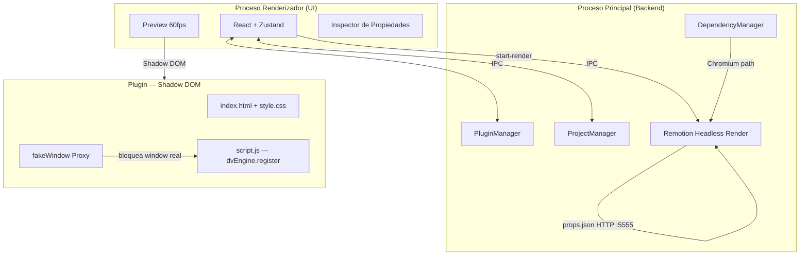

El **Motor de Gráficos Vectoriales Dinámicos (DVGE)** está construido sobre una arquitectura híbrida de alto rendimiento diseñada para la confiabilidad en la transmisión profesional.

## Modelo de Procesos Híbrido

La aplicación opera usando un modelo de proceso dual separado por un puente de comunicación interna (IPC). Esto asegura que las tareas pesadas de la interfaz de usuario no bloqueen la lógica central del motor.

| Proceso | Responsabilidades Principales | Tecnologías |
| :--- | :--- | :--- |
| **Renderizador (UI)** | Interfaz React, Estado Zustand, Previsualización 60FPS | React + Vite |
| **Principal (Backend)** | Gestor de Plugins, E/S de Archivos, Render Headless | Node.js + Electron |

Los procesos se comunican a través de un **Puente IPC** robusto que garantiza la integridad de los datos en cada fotograma.

### 1. Proceso Renderizador (Frontend)
Maneja la interfaz de usuario, la previsualización en tiempo real a 60FPS y la gestión de propiedades. Traduce el código del plugin en fotogramas visuales instantáneamente usando un mecanismo de **Hard Reset** para asegurar cero fugas de estado entre proyectos.

### 2. Proceso Principal (Backend)
Se ejecuta en un entorno Node.js y es responsable de:
- Leer y escribir archivos de proyecto.
- Orquestar el renderizado de video headless.
- Escanear el sistema en busca de plugins compatibles.
- **[v5.6.0]** Gestión de Proyectos (Renombrado, Eliminación Atómica).
- **[v5.6.0]** Auto-Fetch de dependencias (Chromium/FFmpeg).
- Gestionar el Servidor Local WebSocket para integraciones externas.
- Compilar y servir el PDF de reglas del motor vía IPC `generate-rules-pdf`.

---

## Sandbox de Seguridad y Aislamiento

DVGE v5.6.0 implementa una estrategia de seguridad de múltiples capas para asegurar que los plugins de terceros no puedan comprometer el sistema anfitrión.

### 1. Proxy `fakeWindow`
Los plugins no tienen acceso al objeto `window` real ni a las APIs de Electron. El motor inyecta un **Proxy** que restringe el acceso únicamente a los métodos permitidos y al Shadow DOM.

### 2. Encapsulación con Shadow DOM
Cada plugin se renderiza dentro de un **Shadow Root**. Esta tecnología asegura un aislamiento total de estilos:
- Ningún CSS de la aplicación afecta al plugin.
- Ningún CSS del plugin se filtra hacia la interfaz de la aplicación.
- El posicionamiento absoluto (1920x1080) se mantiene consistente en todos los entornos.

---

## Knowledge Bridge Nativo (v5.6.0 GA)

El **Knowledge Bridge** es un sistema de inyección de contexto diseñado para eliminar la fricción entre el motor y los asistentes de IA.

### 1. Generación de PDF de Reglas (IPC `generate-rules-pdf`)
El backend expone un handler IPC que compila todas las reglas del motor (Sandbox, API, Shadow DOM, Utils) en un archivo `.pdf` físico almacenado en caché en el sistema del usuario.

### 2. Drag-to-AI UI
En el plugin "DVGE Studio Master", el campo tipo `prompt` del inspector expone una zona draggable. Al arrastrar esta zona a una IA, se lanza el evento `startDrag` nativo de Electron con la ruta del PDF como payload, permitiendo inyección directa de contexto sin copiar texto.

---

## Motor de Renderizado: Independencia y Auto-Fetch (v5.6.0+)

La versión 5.6 introduce la capa de **Independencia de Dependencias** para resolver la "fragilidad" del entorno de usuario:

### 1. Dependency Manager
El motor ya no depende de que el usuario tenga Chrome instalado globalmente. En el primer inicio:
- Detecta la ausencia de Chromium.
- Descarga una versión *headless* certificada en `%APPDATA%\DVGE\bin`.
- Resuelve dinámicamente la ruta de FFmpeg para la codificación ProRes 4444.

### 2. Transparency Transformer
El motor asegura una transparencia profesional mediante tres capas:
- **Chromium Flags**: Inyección de `--transparent-background-color=0`.
- **JS Injection**: Uso de `evaluatePage` para forzar `background-color: transparent` antes de cada captura de cuadro.
- **Formato ProRes**: Exportación en `yuva444p10le` para compatibilidad nativa con DaVinci Resolve.

### 3. Data Probe Hydration (Resolución de Límites CLI)
Para evitar la pérdida de datos en Windows (causada por el límite de caracteres en la línea de comandos), el motor utiliza un sistema de **Sonda de Datos**:
- El backend levanta un servidor HTTP efímero.
- El renderizador solicita las propiedades del proyecto vía un fetch local a `/props.json`.

---

## Persistencia Atómica (I/O)

Para prevenir la corrupción de proyectos, DVGE utiliza una estrategia de **E/S Asíncrona Atómica**:

1.  **Debouncing**: Los cambios se almacenan en un búfer durante 500ms para reducir las escrituras en disco.
2.  **Escritura Temporal**: El estado se escribe primero en un archivo `.tmp`.
3.  **Renombrado Atómico**: Sólo tras una escritura exitosa, el archivo `.tmp` reemplaza al `project.json` real.

Este flujo garantiza que una caída del sistema o un fallo de energía durante un autoguardado nunca destruirá el trabajo del usuario.
