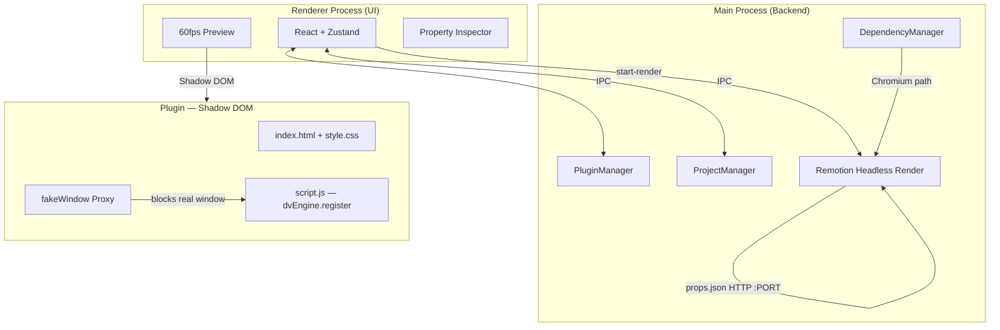

**Ember Motion Studio** is built on a high-performance hybrid architecture engineered for broadcast-grade reliability. The core of the system is powered by the **DVGE rendering engine**.

## Hybrid Process Model

The application operates using a dual-process model separated by an Inter-Process Communication (IPC) bridge. This ensures that heavy UI tasks do not block the core engine logic, delivering a frame-perfect motion design experience.

```mermaid
graph TD
    subgraph Renderer["Renderer Process (UI)"]
        R1["React + Zustand"]
        R2["60fps Preview"]
        R3["Property Inspector"]
    end

    subgraph Main["Main Process (Backend)"]
        M1["PluginManager"]
        M2["ProjectManager"]
        M3["Remotion Headless Render"]
        M4["DependencyManager"]
    end

    subgraph PluginDOM["Plugin — Shadow DOM"]
        P1["index.html + style.css"]
        P2["script.js — dvEngine.register"]
        P3["fakeWindow Proxy"]
    end

    R1 <-->|IPC| M1
    R1 <-->|IPC| M2
    R1 -->|start-render| M3
    M3 -->|props.json HTTP :PORT| M3
    M4 -->|Chromium path| M3
    R2 -->|Shadow DOM| PluginDOM
    P3 -->|blocks real window| P2
```

| Process | Core Responsibilities | Technologies |
| :--- | :--- | :--- |
| **Renderer (UI)** | React Interface, Zustand State, 60FPS Real-Time Preview | React + Vite |
| **Main (Backend)** | Plugin Manager, Atomic File I/O, Headless Video Rendering | Node.js + Electron |

Processes communicate via a robust **IPC Bridge** that guarantees data integrity for every broadcast overlay rendered.

### 1. Renderer Process (Frontend)

Handles the **Ember** user interface, 60FPS real-time preview, and property management. It translates plugin code into visual frames instantaneously using a **Hard Reset** mechanism to ensure zero state leaks between projects.

### 2. Main Process (Backend)

Runs in a Node.js environment and is responsible for:

- Reading and writing project files atomically.
- Orchestrating headless video rendering via **DVGE**.
- Scanning the system for compatible plugins.
- **[v5.8.0]** Deterministic Boot Sequence (Hardware Scanner + esbuild Sync).
- **[v5.6.0]** Project Management (Atomic Rename/Delete).
- **[v5.6.0]** Dependency Auto-Fetch (Chromium/FFmpeg).
- Managing the Local WebSocket Server for external integrations (OBS, Twitch, vMix).
- Compiling and serving engine rule contexts via IPC.

---

## Security Sandbox & Isolation

**Ember Motion Studio** implements a multi-layer security strategy to ensure that third-party plugins cannot compromise the host system.

### 1. `fakeWindow` Proxy

Plugins do not have access to the real `window` object or Electron APIs. The engine injects a **Proxy** that restricts access strictly to allowed methods and the Shadow DOM.

### 2. Shadow DOM Encapsulation

Each plugin is rendered inside a **Shadow Root**. This technology ensures total style isolation:

- No application CSS affects the plugin.
- No plugin CSS leaks into the application UI.
- Absolute positioning (1920x1080) remains consistent across all environments, perfect for lower thirds and stingers.

---

## Knowledge Bridge AI (v5.8.0 Master)

The **Knowledge Bridge** is a context injection system designed to eliminate friction between the engine and AI assistants.

### 1. Technical Context Generation

The backend exposes an IPC handler that compiles all engine rules (Sandbox, API, Shadow DOM, Utils) so the AI understands the execution environment.

### 2. Drag-to-AI UI

In the "Ember Studio Master" plugin, the `prompt` inspector field exposes a draggable zone. Dragging this zone into an AI (Claude, ChatGPT) directly injects the technical context, allowing the AI to generate deterministic, working code on the very first try.

---

## Rendering Engine: Independence and Honest Boot (v5.8.0+)

Version 5.8 introduces the **Deterministic Boot Sequence** and refines the independence layer to eliminate the startup "black screen":

### 1. Honest Boot Sequence (v5.8.0 Master)

The engine no longer hides its initialization process. The **Ember** UI reports in real-time:

- **Hardware Scan**: GPU (VRAM) and CPU detection to optimize real-time rendering.
- **esbuild Sync**: Preparing the plugin build pipeline before allowing interaction.
- **Module Assembly**: Sequential loading of project and plugin managers.

### 2. Dependency Manager

The engine no longer relies on a globally installed Chrome instance. On first launch:

- It detects the absence of Chromium.
- Downloads a certified *headless* version into the application directory.
- Dynamically resolves the FFmpeg path for ProRes 4444 encoding.

### 3. Transparency Transformer

The engine ensures broadcast-grade transparent backgrounds through three layers:

- **Chromium Flags**: Injection of `--transparent-background-color=0`.
- **JS Injection**: Utilizing `evaluatePage` to enforce `background-color: transparent` before each frame capture.
- **ProRes Format**: Exporting in `yuva444p10le` for native alpha channel compatibility with professional video editors like DaVinci Resolve and Premiere Pro.

---

## Atomic Persistence (I/O)

To prevent project corruption, **Ember** uses an **Asynchronous Atomic I/O** strategy:

1. **Debouncing**: Changes are buffered for 500ms to reduce disk writes.
2. **Temporary Write**: State is first written to a `.tmp` file.
3. **Atomic Rename**: Only after a successful write does the `.tmp` file replace the actual project file.

This workflow guarantees that a system crash or power failure during an autosave will never destroy user work.
