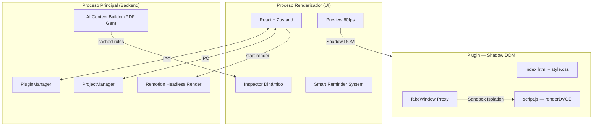

**Ember Motion Studio** (v5.9.0) está construido sobre una arquitectura híbrida de alto rendimiento diseñada para la confiabilidad en la producción broadcast. El núcleo del sistema es el motor de renderizado determinista **Ember**.

## Modelo de Procesos Híbrido

La aplicación opera usando un modelo de proceso dual (Main y Renderer) separado por un puente de comunicación interna (IPC). Esto asegura que las tareas pesadas de la interfaz de usuario no bloqueen la lógica central del motor.

## Evolución v5.9.0: Master Workflow

La arquitectura 5.9 introduce el **Master Workflow**, un sistema de orquestación que guía al usuario y a la IA a través de un pipeline predecible:

### 1. AI Context Builder (Knowledge Bridge)
El backend expone un handler IPC que compila dinámicamente:
- **API del Sistema**: Reglas de Sandbox, Shadow DOM y Utils.
- **Contexto de Artefactos**: Nombres y descripciones de los medios cargados por el usuario.
- **Contexto de Proyecto**: Dimensiones, FPS y duración.
El resultado es un manual técnico en PDF que se inyecta directamente en la IA para garantizar código compatible al primer intento.

### 2. Inspector Dinámico y Artifact Linking
El inspector ahora es capaz de resolver referencias a artefactos. Si un plugin solicita una imagen, el motor permite al usuario vincularla directamente desde su galería de medios, gestionando la resolución de rutas de forma transparente.

### 3. Studio Guide Reminder (Smart Tip)
Un sistema de recordatorios no intrusivo implementado en la capa de UI. Utiliza estados de hover avanzados para volverse transparente cuando el usuario interactúa con los paneles inferiores, garantizando visibilidad sin obstrucción.

---

## Seguridad y Aislamiento (Sandbox)

### Proxy `fakeWindow`
Los plugins no tienen acceso al objeto `window` real ni a las APIs de Node/Electron. El motor inyecta un **Proxy** que restringe el acceso únicamente a los métodos permitidos y al Shadow DOM.

### Shadow DOM v2
Cada plugin se renderiza dentro de un **Shadow Root**. Esta tecnología asegura un aislamiento total:
- **Estilos Estancos**: Los estilos del plugin no afectan a la UI de la aplicación y viceversa.
- **Encapsulamiento de Eventos**: Previene que scripts maliciosos o mal formados intercepten la entrada del usuario en el editor.

---

## Renderizado Determinista (ProRes 4444)

El motor asegura una transparencia profesional mediante tres capas:
- **Chromium Flags**: Inyección de `--transparent-background-color=0`.
- **Atomic JS Injection**: Forzado de `background-color: transparent` antes de cada captura de cuadro.
- **YUVA 4:4:4:4**: Exportación en 10 bits para compatibilidad nativa con Premiere y DaVinci Resolve.

(Actualizado para Ember v5.9.0 Stable)
